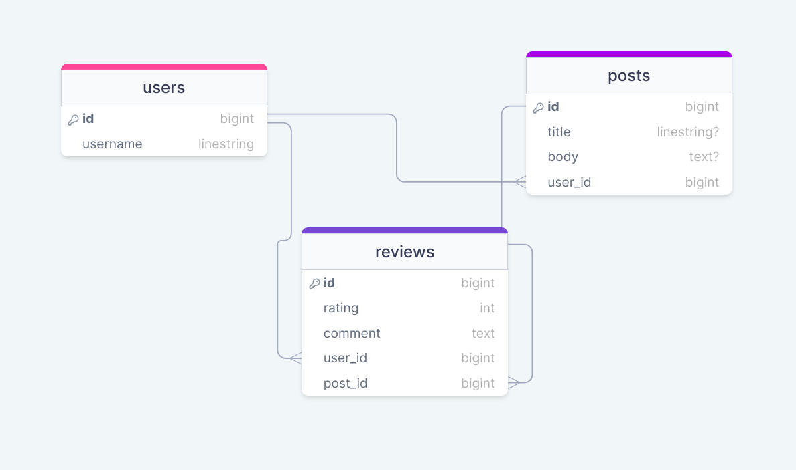

## Running The API 

Clone the project

```bash
git clone https://github.com/aminyasser/inova-task.git
cd inova-task
```


```bash
 bundle install
```

```bash
  rails db:migrate
  rails db:seed
```

## Endpointes

```http
POST /posts

{
    "user_id": 1,
    "title": "test",
    "body": "test"
}

GET  /users/1/posts
GET  /posts/top
POST /posts/1/reviews
{
    "user_id": 1,
    "comment": "test comment",
    "rating": 1
}

```
## Databsse

